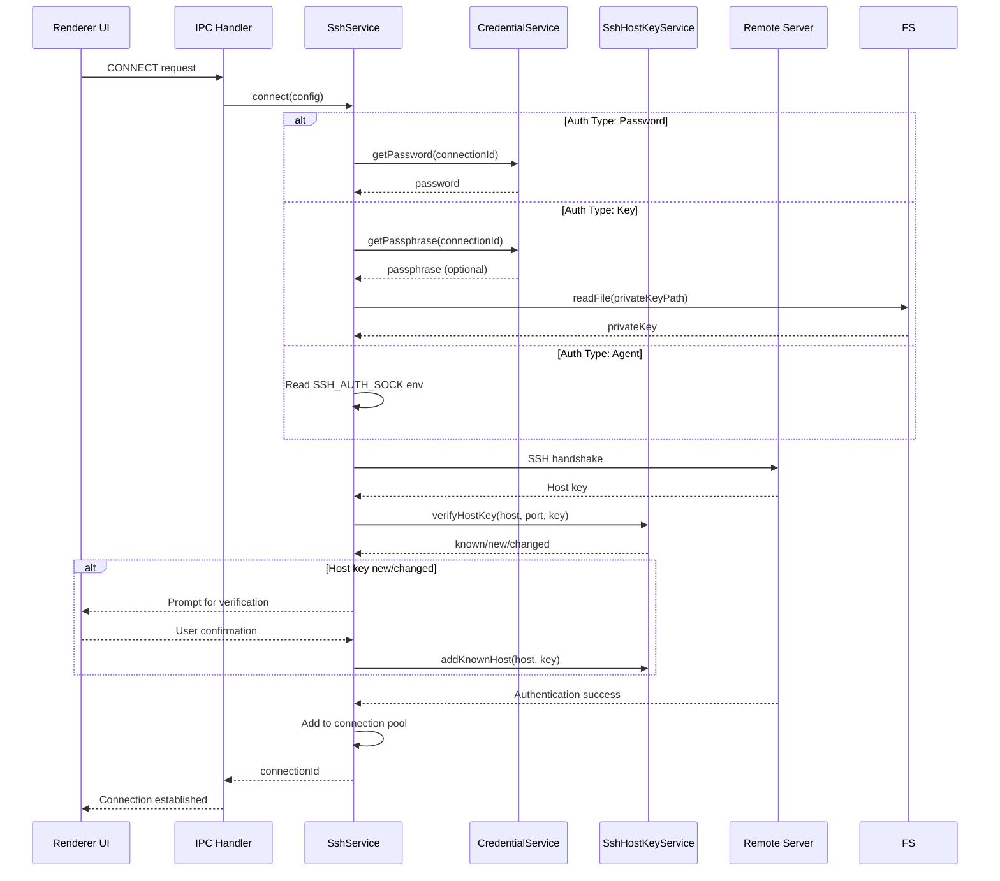

# SSH Architecture Documentation

Technical documentation for Valkyr's SSH remote development feature.

## Architecture Overview

The SSH feature enables remote development by connecting to servers via SSH and providing SFTP access for file operations. It consists of multiple services working together across the Electron main and renderer processes.

### High-Level Flow

```
┌─────────────────┐     ┌──────────────────┐     ┌─────────────────┐
│   Renderer      │     │   Main Process   │     │   Remote        │
│   (React UI)    │◄───►│   (Node/Electron)│◄───►│   Server        │
└────────┬────────┘     └────────┬─────────┘     └─────────────────┘
         │                       │
         │   IPC Calls           │   ssh2 Library
         │   (ssh:* channels)    │   (Client/SFTP)
         │                       │
         ▼                       ▼
┌─────────────────┐     ┌──────────────────┐
│  React Hooks    │     │  SSH Services    │
│  - useSsh       │     │  - SshService    │
│  - useRemoteFS  │     │  - SshHostKey    │
│                 │     │  - SshCredential │
└─────────────────┘     └──────────────────┘
```

## Component Diagram

```
┌─────────────────────────────────────────────────────────────────────────┐
│                           RENDERER PROCESS                               │
├─────────────────────────────────────────────────────────────────────────┤
│                                                                         │
│  ┌──────────────────┐  ┌──────────────────┐  ┌──────────────────┐      │
│  │ SshConnectionForm│  │SshConnectionList │  │SshSettingsCard   │      │
│  │                  │  │                  │  │                  │      │
│  │ - Host config    │  │ - List view      │  │ - Settings UI    │      │
│  │ - Auth type sel  │  │ - Connect/Disco  │  │ - Preferences    │      │
│  │ - Key file pick  │  │ - Status display │  │                  │      │
│  └────────┬─────────┘  └────────┬─────────┘  └────────┬─────────┘      │
│           │                     │                     │                │
│           └─────────────────────┼─────────────────────┘                │
│                                 │                                      │
│                                 ▼                                      │
│                    ┌──────────────────────┐                           │
│                    │  useSshConnections   │                           │
│                    │                      │                           │
│                    │  - Connection state  │                           │
│                    │  - CRUD operations   │                           │
│                    │  - IPC abstraction   │                           │
│                    └──────────┬───────────┘                           │
│                               │                                        │
└───────────────────────────────┼────────────────────────────────────────┘
                                │ IPC
                                ▼
┌─────────────────────────────────────────────────────────────────────────┐
│                             MAIN PROCESS                                 │
├─────────────────────────────────────────────────────────────────────────┤
│                                                                         │
│  ┌─────────────────────────────────────────────────────────────────┐   │
│  │                      sshIpc.ts                                   │   │
│  │  ┌─────────────────────────────────────────────────────────┐    │   │
│  │  │  IPC Handlers (SSH_IPC_CHANNELS)                        │    │   │
│  │  │  - TEST_CONNECTION  - SAVE_CONNECTION                   │    │   │
│  │  │  - GET_CONNECTIONS  - DELETE_CONNECTION                 │    │   │
│  │  │  - CONNECT          - DISCONNECT                        │    │   │
│  │  │  - EXECUTE_COMMAND  - LIST_FILES                        │    │   │
│  │  │  - READ_FILE        - WRITE_FILE                        │    │   │
│  │  │  - GET_STATE        - ON_STATE_CHANGE                   │    │   │
│  │  └─────────────────────────────────────────────────────────┘    │   │
│  └─────────────────────────────┬───────────────────────────────────┘   │
│                                │                                        │
│  ┌─────────────────────────────┼───────────────────────────────────┐   │
│  │                             ▼                                   │   │
│  │  ┌──────────────────┐  ┌─────────────┐  ┌──────────────────┐   │   │
│  │  │  SshService      │  │ SshHostKey  │  │ SshCredential    │   │   │
│  │  │  ─────────────   │  │ ─────────── │  │ ──────────────── │   │   │
│  │  │  Connection pool │  │ Host key    │  │ Keychain storage │   │   │
│  │  │  Command exec    │  │ verification│  │ Password mgmt    │   │   │
│  │  │  SFTP wrapper    │  │ known_hosts │  │ Passphrase mgmt  │   │   │
│  │  └────────┬─────────┘  └─────────────┘  └──────────────────┘   │   │
│  │           │                                                    │   │
│  │           ▼                                                    │   │
│  │  ┌──────────────────┐  ┌──────────────────┐                   │   │
│  │  │  RemoteGitService│  │ RemotePtyService │                   │   │
│  │  │  ─────────────── │  │ ──────────────── │                   │   │
│  │  │  Git over SSH    │  │ Interactive shell│                   │   │
│  │  │  Worktree mgmt   │  │ Agent execution  │                   │   │
│  │  └──────────────────┘  └──────────────────┘                   │   │
│  │                                                                │   │
│  └────────────────────────────────────────────────────────────────┘   │
│                                                                       │
│  ┌─────────────────────────────────────────────────────────────────┐  │
│  │  DATABASE (SQLite via Drizzle)                                   │  │
│  │  - ssh_connections table                                         │  │
│  │  - projects table (with ssh_connection_id, is_remote)            │  │
│  └─────────────────────────────────────────────────────────────────┘  │
│                                                                       │
└───────────────────────────────────────────────────────────────────────┘
```

## Security Model

### Threat Model

| Threat | Mitigation |
|--------|------------|
| Credential theft | Passwords stored in OS keychain, not database |
| MITM attacks | Host key verification via known_hosts |
| Key exfiltration | Private key paths only, never content |
| Session hijacking | Connection timeouts, keepalive checks |
| Command injection | Shell argument escaping |

### Authentication Security

```
┌─────────────────────────────────────────────────────────────────┐
│                     AUTHENTICATION FLOW                          │
├─────────────────────────────────────────────────────────────────┤
│                                                                  │
│  User Input          Valkyr Processing         Storage          │
│  ──────────          ────────────────         ────────          │
│                                                                  │
│  Password ─────────► CredentialService ─────► OS Keychain       │
│                      (keytar)                                    │
│                                                                  │
│  Passphrase ───────► CredentialService ─────► OS Keychain       │
│                      (keytar)                                    │
│                                                                  │
│  Private Key Path ──► Path stored in DB ───► File System        │
│                       (content never read                        │
│                        until connection)                         │
│                                                                  │
│  SSH Agent ─────────► SSH_AUTH_SOCK env ───► System Agent       │
│                       var used directly                          │
│                                                                  │
└─────────────────────────────────────────────────────────────────┘
```

### Data Flow Security

1. **Connection Config:** Stored in SQLite (no secrets)
2. **Credentials:** Stored in OS keychain via `keytar`
3. **Host Keys:** Stored in `~/.ssh/known_hosts` (shared)
4. **Session Data:** In-memory only, cleared on disconnect

## Authentication Flow

### Connection Establishment



### Host Key Verification States

```
┌─────────────────────────────────────────────────────────────────┐
│                    HOST KEY VERIFICATION                         │
├─────────────────────────────────────────────────────────────────┤
│                                                                  │
│  Server presents key ───┬───► Known? ───Yes───► Valid?          │
│                         │                      │                 │
│                         │                      ├──Yes──► ALLOW   │
│                         │                      │                 │
│                         │                      └──No────► WARN   │
│                         │                         (changed key)  │
│                         │                                        │
│                         └───► No ───► PROMPT user                │
│                                          │                       │
│                                          ├──Accept──► ADD & ALLOW│
│                                          │                       │
│                                          └──Reject──► DENY       │
│                                                                  │
└─────────────────────────────────────────────────────────────────┘
```

## File Operations over SFTP

### SFTP Session Management

```typescript
// SFTP sessions are lazily created and cached
async getSftp(connectionId: string): Promise<SFTPWrapper> {
  const connection = this.connections[connectionId];
  
  // Return cached SFTP if available
  if (connection.sftp) {
    connection.lastActivity = new Date();
    return connection.sftp;
  }
  
  // Create new SFTP session over existing SSH
  return new Promise((resolve, reject) => {
    connection.client.sftp((err, sftp) => {
      if (err) reject(err);
      connection.sftp = sftp;  // Cache for reuse
      resolve(sftp);
    });
  });
}
```

### File Operation Flow

```
┌─────────────────────────────────────────────────────────────────┐
│                     SFTP OPERATIONS                              │
├─────────────────────────────────────────────────────────────────┤
│                                                                  │
│  listFiles(path)        readFile(path)       writeFile(path)    │
│       │                      │                    │               │
│       ▼                      ▼                    ▼               │
│  ┌─────────┐           ┌─────────┐          ┌─────────┐          │
│  │ Get SFTP│           │ Get SFTP│          │ Get SFTP│          │
│  │ session │           │ session │          │ session │          │
│  │ (cached)│           │ (cached)│          │ (cached)│          │
│  └────┬────┘           └────┬────┘          └────┬────┘          │
│       │                      │                    │               │
│       ▼                      ▼                    ▼               │
│  sftp.readdir()        sftp.readFile()     sftp.writeFile()     │
│       │                      │                    │               │
│       ▼                      ▼                    ▼               │
│  Array<FileEntry>      Buffer/string        Success/Error        │
│                                                                  │
└─────────────────────────────────────────────────────────────────┘
```

### FileEntry Structure

```typescript
interface FileEntry {
  path: string;        // Full remote path
  name: string;        // Filename
  type: 'file' | 'directory' | 'symlink';
  size: number;        // Bytes
  modifiedAt: Date;    // Modification timestamp
  permissions?: string; // Unix permissions (e.g., '644')
}
```

## Git Operations over SSH

### RemoteGitService Architecture

```typescript
class RemoteGitService {
  constructor(private sshService: SshService) {}
  
  // All Git operations execute commands via SSH
  async getStatus(connectionId: string, worktreePath: string): Promise<GitStatus> {
    const result = await this.sshService.executeCommand(
      connectionId,
      'git status --porcelain -b',
      worktreePath
    );
    // Parse output and return structured status
  }
  
  async createWorktree(
    connectionId: string,
    projectPath: string,
    taskName: string,
    baseRef?: string
  ): Promise<WorktreeInfo> {
    // Create worktree directory
    // Run git worktree add command
    // Return worktree info
  }
}
```

### Git Command Execution Flow

```
┌─────────────────────────────────────────────────────────────────┐
│                   GIT OPERATION FLOW                             │
├─────────────────────────────────────────────────────────────────┤
│                                                                  │
│  UI Action                                                        │
│     │                                                            │
│     ▼                                                            │
│  RemoteGitService.method()                                       │
│     │                                                            │
│     ├──► Build Git command string                                │
│     │                                                            │
│     ├──► Escape shell arguments (security)                       │
│     │                                                            │
│     └──► sshService.executeCommand(connectionId, cmd, cwd)       │
│                   │                                              │
│                   ▼                                              │
│            client.exec(command, callback)                        │
│                   │                                              │
│                   ▼                                              │
│            Remote Git process                                    │
│                   │                                              │
│                   ▼                                              │
│            Return ExecResult                                     │
│            { stdout, stderr, exitCode }                          │
│                   │                                              │
│                   ▼                                              │
│            Parse/Process result                                  │
│                   │                                              │
│                   ▼                                              │
│            Return to UI                                          │
│                                                                  │
└─────────────────────────────────────────────────────────────────┘
```

### Shell Argument Escaping

Security-critical: All user-controlled paths are escaped:

```typescript
private escapeShellArg(arg: string): string {
  // Replace single quotes with '"'"' and wrap in single quotes
  // This prevents shell injection attacks
  return `'${arg.replace(/'/g, "'\"'\"'")}'`;
}

// Example:
// Input:  /path/with'quote
// Output: '/path/with'"'"'quote'
```

## Connection Pool Management

```typescript
interface Connection {
  id: string;
  config: SshConfig;
  client: Client;           // ssh2 Client instance
  sftp?: SFTPWrapper;       // Optional SFTP session
  connectedAt: Date;
  lastActivity: Date;
}

type ConnectionPool = Record<string, Connection>;
```

### Connection Lifecycle

1. **Create:** `connect(config)` → Add to pool → Emit 'connected'
2. **Use:** Get from pool → Update `lastActivity`
3. **Health Check:** Keepalive pings every 60s
4. **Disconnect:** `disconnect(id)` → Remove from pool → Emit 'disconnected'
5. **Cleanup:** On app quit → `disconnectAll()`

### Event-Driven Architecture

```typescript
export class SshService extends EventEmitter {
  // Events:
  // - 'connected': (connectionId) => void
  // - 'error': (connectionId, Error) => void
  // - 'disconnected': (connectionId) => void
}
```

## Database Schema

### SSH Connections Table

```typescript
export const sshConnections = sqliteTable('ssh_connections', {
  id: text('id').primaryKey(),
  name: text('name').notNull(),
  host: text('host').notNull(),
  port: integer('port').notNull().default(22),
  username: text('username').notNull(),
  authType: text('auth_type').notNull().default('agent'),
  privateKeyPath: text('private_key_path'),  // Path only, not content
  useAgent: integer('use_agent').notNull().default(0),
  createdAt: text('created_at').notNull(),
  updatedAt: text('updated_at').notNull(),
});
```

### Projects Table (Remote Extensions)

```typescript
export const projects = sqliteTable('projects', {
  // ... local project fields ...
  sshConnectionId: text('ssh_connection_id')
    .references(() => sshConnections.id, { onDelete: 'set null' }),
  isRemote: integer('is_remote').notNull().default(0),
  remotePath: text('remote_path'),  // Path on remote server
});
```

## Error Handling

### Connection Errors

| Error | Cause | Resolution |
|-------|-------|------------|
| `ECONNREFUSED` | SSH not running | Check server and port |
| `ETIMEDOUT` | Network issue | Check connectivity, firewall |
| `Authentication failed` | Wrong credentials | Verify auth method |
| `Host key verification failed` | Unknown/changed key | Verify and trust key |
| `No password found` | Missing credential | Re-enter password |

### SFTP Errors

| Error | Cause | Resolution |
|-------|-------|------------|
| `No such file` | Path doesn't exist | Check remote path |
| `Permission denied` | Insufficient rights | Check file permissions |
| `SFTP session not open` | Connection lost | Reconnect |

## Testing Guidelines

### Unit Tests

Test each service in isolation:
- `SshCredentialService` - Mock keytar
- `SshHostKeyService` - Mock filesystem
- `SshService` - Mock ssh2 Client

### Integration Tests

Test with actual SSH server (Docker container):
- Connection lifecycle
- Authentication methods
- File operations
- Git operations

### Security Tests

- Host key verification
- Shell injection attempts
- Credential storage
- Connection timeout handling

## References

- [ssh2 library documentation](https://github.com/mscdex/ssh2)
- [OpenSSH documentation](https://www.openssh.com/manual.html)
- [SFTP protocol spec](https://datatracker.ietf.org/doc/html/draft-ietf-secsh-filexfer-02)
